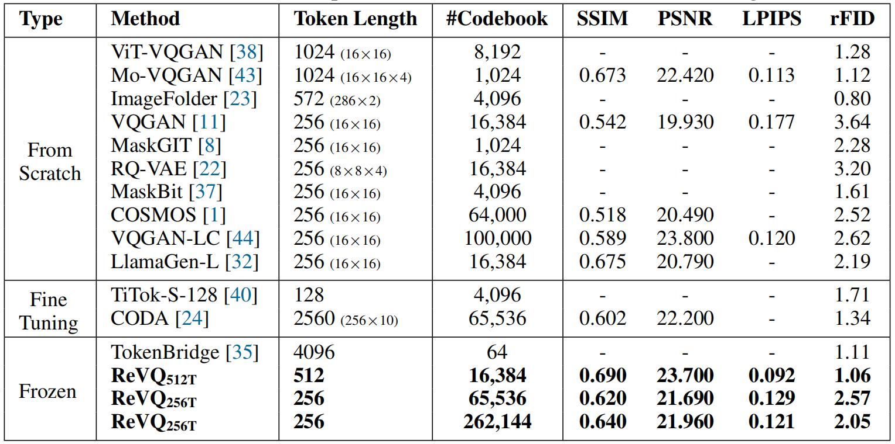

# Quantize-then-Rectify: Efficient VQ-VAE Training

<!-- [](https://arxiv.org/abs/2412.15195) -->
[](https://neur-io.github.io/ReVQ/)
[](https://huggingface.co/spaces/AndyRaoTHU/ReVQ)
[](https://zhuanlan.zhihu.com/p/1910111424765728444)

- ***ReVQ achieves the optimal trade-off between training efficiency and compression ratio, maintaining competitive reconstruction quality compared to SOTA VQ-VAEs.***
- ***If you are interested in the training stability of VQ-VAE, please check out our previous work [OptVQ](https://github.com/Neur-IO/OptVQ)***


## News

| **2025-07-14:** We release the training code of ReVQ.  

## Introduction

We conduct image reconstruction experiments on the ImageNet dataset, and the quantitative comparison is shown below:



Our ReVQ method starts from a pre-trained [DC-AE](https://github.com/mit-han-lab/efficientvit/blob/master/applications/dc_ae/README.md) model and transforms the continuous VAE model into a VQ-VAE model. 
Compared with training a VQ-VAE model from scratch, the required training time is greatly reduced, as shown below:


## Installation
Please install the dependencies by running the following command:
```bash
# install the dependencies
pip install -r requirements.txt
# install the packages
pip install -e .
```

## Usage

### Inference

Please download the pre-trained models from the following links:

| Model | Link (Tsinghua) | Link (Hugging Face) |
| - | - | - |
| ReVQ (512T) | [Download](https://cloud.tsinghua.edu.cn/d/d2a6e907b7214c2780ac/) | [Download](https://huggingface.co/AndyRaoTHU/revq-512T) |
| ReVQ (256T-B) | [Download](https://cloud.tsinghua.edu.cn/d/24f779196b5f42f3a1f4/) | [Download](https://huggingface.co/AndyRaoTHU/revq-256T-B) |
| ReVQ (256T-L) | [Download](https://cloud.tsinghua.edu.cn/d/24975dfbd17843c19d1d/) | [Download](https://huggingface.co/AndyRaoTHU/revq-256T-L) |

#### Option 1: Load from Hugging Face

You can load from the Hugging Face model hub by running the following code:
```python
# Example: load the ReVQ with 512T
from xvq.models.revq import ReVQ
model = ReVQ.from_pretrained("AndyRaoTHU/revq-512T")
```

#### Option 2: Load from the local checkpoint

You can also write the following code to load the pre-trained model locally:
```python
# Example: load the ReVQ with 512T
from xvq.models import setup_models
from xvq.config import get_config
import torch
config = get_config()
# setup the model
quantizer, decoder, _ = setup_models(config.model, device)

# load the pre-trained model
checkpoint = torch.load(os.path.join(config.log_path, "ckpt.pth"), map_location=device, weights_only=True)
quantizer.load_state_dict(checkpoint["quantizer"])
decoder.load_state_dict(checkpoint["decoder"])
```

#### Perform inference

After loading the model, you can perform inference (reconstruction):

```python
from diffusers import AutoencoderDC
from xvq.models.revq import ReVQ
from xvq.dataset import load_preprocessor

# load the dataset and pre-trained models
dataset = ... # the input should be normalized to [-1, 1]
data = dataset[...] # size: (BS, C, H, W)
vae = AutoencoderDC.from_pretrained("mit-han-lab/dc-ae-f32c32-sana-1.1-diffusers")
preprocessor = load_preprocessor(device=data.device, is_eval=True,
                                 ckpt_path="ckpt/preprocessor.pth")
model = ReVQ.from_pretrained("AndyRaoTHU/revq-512T")

# reconstruct the input
with torch.no_grad():
    lat = vae.encode(data).latent.contiguous()
    lat = preprocessor(lat)
    lat = model.quantize(lat)
    lat = model.decode(lat).contiguous()
    lat = preprocessor.inverse(lat)
    recon = vae.decode(lat).sample
```

## Preparation for Training
### Dataset 
Please download the ImageNet dataset from the official website and place it in the following format:
```
data
└───imagenet
    └───train
        └───n01440764
            └───n01440764_10026.JPEG
            └───n01440764_10027.JPEG
            ...
        └───n01443537
            └───n01443537_1000.JPEG
            ...
    └───val
        └───n01440764
            └───ILSVRC2012_val_00000293.JPEG
            ...
```
### Data Processing Guide
**Step 1: Download Pre-trained DC-AE Model**
Execute the following command to download the pre-trained Deep Convolutional Autoencoder (DC-AE) model:

```bash
HF_ENDPOINT="https://hf-mirror.com/" huggingface-cli download \
  --resume-download mit-han-lab/dc-ae-f32c32-sana-1.1-diffusers \
  --local-dir ./ckpt/dc_ae
```

**Step 2: Convert ImageNet Dataset to Latent Space**
Run the conversion script to transform ImageNet images into 2048-dimensional(32×8×8) latent vectors(Enter the paths for both the dc_ae model and ImageNet dataset):

```bash
python scripts/convert_imagenet.py 
```
Output will be saved in TAR format.

**Step 3: Package Training and Validation Sets**
Process the latent vectors into PyTorch format(Enter the path for the output of Step 2):
```bash
python scripts/save_imagenet.py 
```
Provide separate TAR files for training and validation sets to generate:
- [`imagenet_train.pth`](imagenet_train.pth)
- [`imagenet_val.pth`](imagenet_val.pth) 

**Step 4: Create Subset for Codebook Initialization**
Generate a subset for quantizer initialization(Enter the path for [`imagenet_train.pth`](imagenet_train.pth)):
```bash
python scripts/convert_subset_dataset.py
```
The output [`subset.pth`](subset.pth) will be used for initializing the quantizer's codebook.

## Training
For the 512-token model described in this paper, execute the following training command:

```bash
config_path=configs/512T_NC=16384.yaml
python scripts/train.py --config $config_path --name 512T --world_size 1 --batch_size 256
```

## Evaluation
To evaluate the model, you can use the following code:

```bash
# Create directory structure
mkdir -p ./outputs/512T_NC=16384

# Place downloaded files
cp /path/to/512T_NC=16384.pth ./outputs/512T_NC=16384/
cp /path/to/512T_NC=16384.yaml ./outputs/512T_NC=16384/

name=512T_NC=16384
python scripts/eval.py --name $name --config outputs/$name/$name.yaml
```

## Visualization
The visualization pipeline requires the pretrained model checkpoint and its corresponding YAML configuration file. Execute with:
```bash
python scripts/visualize.py
```

<!-- ## Future work -->

<!-- ## Citation

If you find this work useful, please consider citing it. -->
